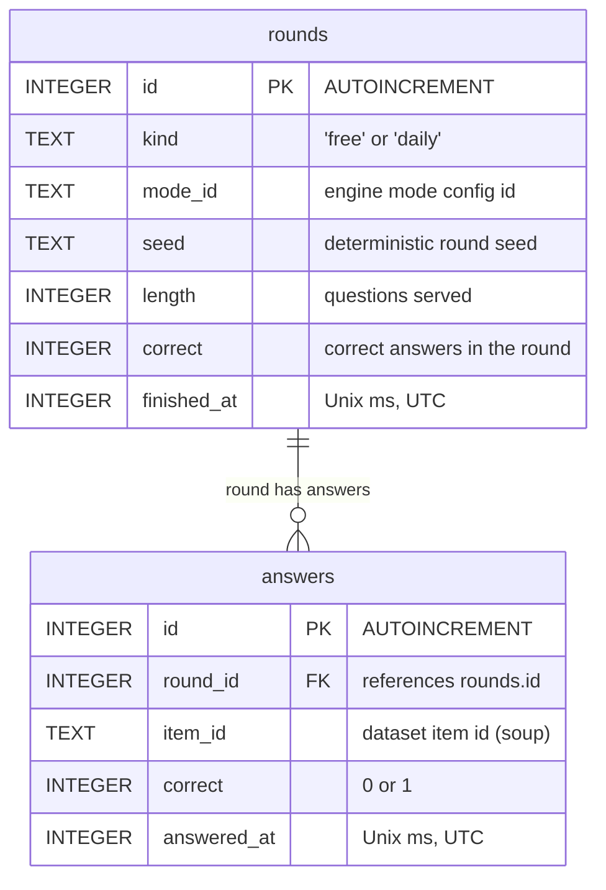

# Database

Soup Quiz is local-first: the only database is **on-device SQLite** (`stats.db`, opened
by `apps/soup-quiz/src/storage/db.ts` via expo-sqlite). There is no backend and no sync —
the file is the app's entire recorded history, and it never leaves the device.

Two append-only tables: one row per finished round, one row per committed answer.
Every derived number (accuracy, streaks, mastery) is computed from these rows in
`packages/stats` — storage itself never computes a stat.

## Entity relationship

## Tables

### `rounds`

One finished round of any kind. Written in a single transaction together with its
answers by `recordRound` (`src/storage/repo.ts`).

| Column | Type | Constraints | Notes |
|---|---|---|---|
| `id` | INTEGER | `PRIMARY KEY AUTOINCREMENT` | Row id; becomes `round_id` in `answers`. |
| `kind` | TEXT | `NOT NULL DEFAULT 'free'` | `'free'` (play screen) or `'daily'` (daily challenge). |
| `mode_id` | TEXT | `NOT NULL` | Engine mode config id — today `'ingredients-to-country'` for free play, `'daily-country'` (`DAILY_MODE_ID`) for dailies. |
| `seed` | TEXT | `NOT NULL` | The seed the round was generated from. For dailies `'daily-<dayIndex>'`, so `(kind, seed)` identifies a day exactly — `fetchDailyRound` looks a day up this way. |
| `length` | INTEGER | `NOT NULL` | Questions served (free play: 5; daily: 4 clue tiers). |
| `correct` | INTEGER | `NOT NULL` | Correct answers in the round. For dailies, the clue tier the soup was solved on (`0` = failed). A daily counts toward the daily streak when `correct >= 1`. |
| `finished_at` | INTEGER | `NOT NULL` | Round completion time, Unix milliseconds UTC. |

### `answers`

One row per committed answer/guess, always inside the transaction of its round.

| Column | Type | Constraints | Notes |
|---|---|---|---|
| `id` | INTEGER | `PRIMARY KEY AUTOINCREMENT` | Row id. |
| `round_id` | INTEGER | `NOT NULL REFERENCES rounds(id)` | Owning round. |
| `item_id` | TEXT | `NOT NULL` | Dataset item id — the soup asked about. Indexed (`answers_item_id`) because mastery aggregates by item. |
| `correct` | INTEGER | `NOT NULL` | `1` correct, `0` wrong. |
| `answered_at` | INTEGER | `NOT NULL` | Answer time, Unix milliseconds UTC. |

## Versioning and house rules

- **Migrations** are plain SQL in the `MIGRATIONS` array of `db.ts`, guarded by
  `PRAGMA user_version`: on open, every migration with index ≥ the stored version runs,
  each in its own transaction, bumping the version. New schema = append a statement
  array; never edit an executed one. Current version: **1**.
- The database opens in **WAL** journal mode (`PRAGMA journal_mode = WAL`).
- Writes go through exactly two paths: `recordRound` (append) and `clearAllStats`
  (the stats screen's confirmed reset — the only delete). No updates, ever: history is
  immutable by design.
- Deleting the app deletes `stats.db` with it; there is no export/backup yet (no such
  feature is specced).
